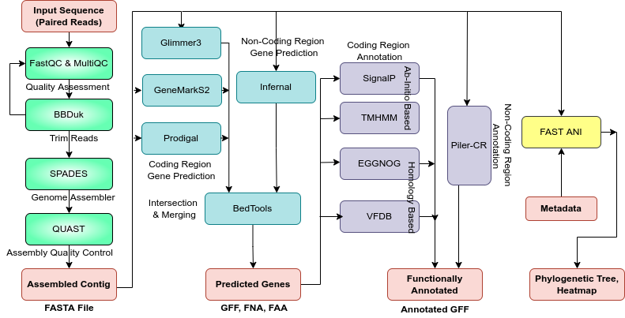

# Team 1 WebServer Backend

####  MEMBERS:

Zack Mudge, Varsha Bhat, Shreyash Gupta, Palak Aggarwal, Mannan Bhola, Erin Connolly, Amartya Mandal

### The pipeline integrated in the backend is shown in this diagram:
<br></br>

<br></br>


####  TOOLS USED:

##### Genome Assembly
[SPAdes](https://www.ncbi.nlm.nih.gov/pmc/articles/PMC3342519/)
[QUAST](https://www.ncbi.nlm.nih.gov/pmc/articles/PMC3624806/)
[FastQC](https://www.bioinformatics.babraham.ac.uk/projects/fastqc/) 

##### Gene Prediction
[Prodigal](https://bmcbioinformatics.biomedcentral.com/articles/10.1186/1471-2105-11-119/)  
[Glimmer3](http://ccb.jhu.edu/papers/glimmer3.pdf/)
[GeneMark-S2](https://pubmed.ncbi.nlm.nih.gov/29773659/)  
[Infernal](https://academic.oup.com/bioinformatics/article/25/10/1335/270663/)  
[bedtools](https://www.ncbi.nlm.nih.gov/pmc/articles/PMC2832824/)  

#####  Functional Annotation
[eggNOG](https://doi.org/10.1093/molbev/msab293/)
[SignalP](https://www.nature.com/articles/s41587-021-01156-3/)
[TMHMM](https://services.healthtech.dtu.dk/service.php?TMHMM-2.0/) 
[VFDB](https://doi.org/10.1093/nar/gkab1107/)
[Piler-CR](https://doi.org/10.1186/1471-2105-8-18/) 

##### Comparative Genomics
[FastANI](https://www.nature.com/articles/s41467-018-07641-9/)

## Installing Dependencies
1. Git clone the repository and copy the envs folder into a different directory. You can change the first line of each yml files to specify the name for your environment.
2. Install [conda](https://docs.conda.io/projects/conda/en/latest/user-guide/install/index.html) or [miniconda](https://docs.conda.io/en/latest/miniconda.html) for the package manager
3. Install dependencies: 
```
conda env create -f envs/T1G1_final_assembly.yml
conda env create -f envs/T1G2_genepred_trial.yml
conda env create -f envs/T1G3_FA.yml
conda env create -f envs/T1G4.yml
```
4. This will create the required environment for all the tools for the pipelines: `conda activate <name_of_env>`

### Directory Structure
```
├── backend
│   ├── master_pipeline.sh
│   ├── data_queue
│   │   └── job0
│   │       └── isolate_1.fq.gz
│   │       └── isolate_2.fq.gz
│   ├── data_results
│   │   ├── assemblies.zip
│   │   ├── gene_predictions.zip
│   │   ├── functional_annotations.zip
│   │   ├── comparative_genomics.zip
│   ├── res
│   │   ├── blast_final.py
│   │   ├── g3-from-scratch.csh
│   │   ├── Glimmer_GFF_conversion.py
│   │   ├── GlimmerPredict2Gff3.pl
│   │   ├── infernal.tblout
│   │   ├── infernal-tblout2gff.pl
│   │   ├── prodigal.linux
│   │   ├── run_FragGeneScan.pl
│   │   └── train
│   ├── scripts
│   │   ├── assembly.py
│   │   ├── bed_tools_merge.py
│   │   ├── comparative_pipeline.py
│   │   ├── FAmodule
│   │   │   ├── blast2gff.py
│   │   │   ├── CRISPRFileToGFF_1.pl
│   │   │   ├── eggScript.py
│   │   │   ├── GFF_merger.py
│   │   │   ├── pilercr_module.py
│   │   │   ├── signalp_script_func.py
│   │   │   ├── tmhmm.py
│   │   │   └── vfdb_module.py
│   │   ├── fastANI2tree.R
│   │   ├── fastANI_heatmap.R
│   │   ├── FunctionalAnnotationPipeline.py
│   │   └── gene_prediction.py
│   ├── T1G1_final_assembly.yml
│   ├── T1G2_genepred_trial.yml
│   ├── T1G3_FA.yml
│   └── T1G4.yml
├── conda_env_req.txt
└── README.md
```

### Inputs:

```
./master_pipeline.sh -j job_id -z
```

#### This will run the complete pipeline starting from the Genome Assembly (GA), Gene Prediction (GP), Functional Annotation (FA) and Comparative Genomics (CG). The shell script activates each of the conda environment and runs the required part of the code (GA, GP, FA, CG) for each of the job in the data_queue. The results will be present in the data_results folder under the same job_id


### Outputs:

#### Genome Assembly
It provides the assembled contigs using SPAdes in the genome_assembly.zip

#### Gene Prediction
It provides the predicted genes taken in consensus using Prodigal, Glimmer3 and GeneMark-S2 in the gene_prediction.zip

#### Functional Annotation
It provides the functionally annotated genes using eggNOG, SignalP, TMHMM, VFDB ,Piler-CR in the functional_annotation.zip

#### Comparative Genomics
It provides the comparision of the user's isolates using FastANI with the 50 isolates in the comparative_genomics.zip

